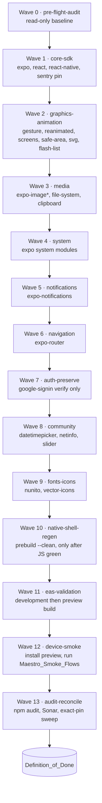
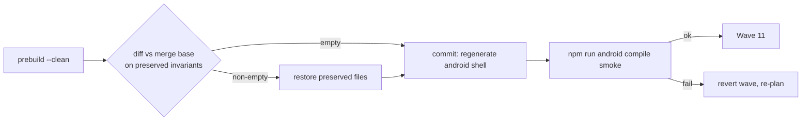
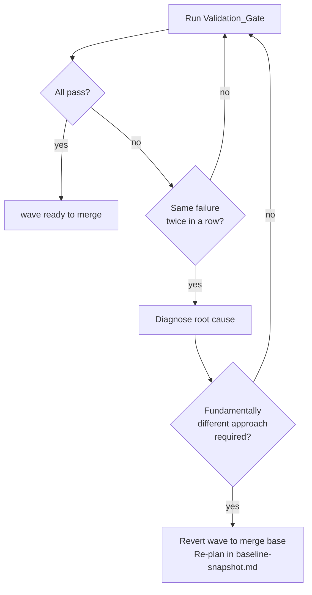

# Design Document — Expo_SDK_Upgrade

## Overview

The Expo_SDK_Upgrade is a strict platform bump executed as a wave-based migration. Each wave is a self-contained PR on its own short-lived branch, validated against the local `Validation_Gate` (`npm run lint`, `npm run typecheck`, `npm test`) before it can merge into the upgrade integration branch. Hard gates between waves prevent compounding diagnosis: a failing wave is reverted and re-planned, never patched on top of a broken predecessor. The change set carries no refactor and no UX work — its only purpose is to unblock the three Dependabot inputs cited in `requirements.md` (Introduction, Req 1).

The verified baseline at design time, read from the workspace HEAD (`package.json`, `app.json`, `metro.config.js`, `app.config.js`, `eas.json`, `vitest.config.ts`):

- `expo` `~55.0.19`
- `react-native` `0.83.6`, `react` `^19.2.6`, `react-dom` `^19.2.6`
- `expo-splash-screen` `~55.0.19`
- TypeScript strict, Vitest 4.x with `lib/**` thresholds 90/90/90/84 (statements/lines/functions/branches)
- React Compiler enabled in `app.json` → `expo.experiments.reactCompiler: true`
- Sentry source-maps wired via `getSentryExpoConfig` in `metro.config.js`
- `withGradleProperties` plugin in `app.config.js` injects `org.gradle.jvmargs=-Xmx4g -XX:MaxMetaspaceSize=1g -XX:+HeapDumpOnOutOfMemoryError`
- `package.json` overrides: `@xmldom/xmldom: ^0.8.13`, `postcss: ^8.5.10`
- `package.json#expo.install.exclude` pins `react`, `react-dom`, `react-native`, `react-native-gesture-handler`, `react-native-reanimated`, `react-native-worklets`, `react-native-safe-area-context`, `react-native-screens`, `react-native-svg`, `@shopify/flash-list`, `@sentry/react-native`, `@react-native-community/slider`, `typescript`
- EAS profiles available: `base`, `development`, `preview`, `production`. Only `development` and `preview` are in scope (Req 6.5)
- Maestro flows present: `.maestro/create-task.yaml`, `.maestro/logout.yaml` (`Maestro_Smoke_Flows`); `_launch-app.yaml` and `_logout-steps.yaml` are fragments

This design is constrained by the non-negotiables in `AGENTS.md` and by Req 5 / Req 6: no auto-running `npx expo install --fix` without HITL approval, no edits to `supabase/migrations/` or `supabase/functions/`, no iOS code paths, no production EAS activity, `Frozen_Auth_Surface` preserved.

## Target SDK Decision (evidence for Req 1.4)

`Target_SDK = Expo SDK 56`.

| Fact | Value | Source |
|---|---|---|
| Target_SDK ships `react-native` | `0.85.x` (release notes call out RN `0.85.2` in beta) | [Expo SDK 56 changelog](https://expo.dev/changelog/sdk-56), [Expo SDK 55 changelog](https://expo.dev/changelog/sdk-55) (announces "SDK 56 will include React Native 0.85") |
| Target_SDK ships `expo-splash-screen` | `56.x` | [`expo-splash-screen` v56 docs](https://docs.expo.dev/versions/v56.0.0/sdk/splash-screen) |
| Target_SDK ships `react` | `19.2.x` (same major/minor as current) | [Expo SDK 55 changelog](https://expo.dev/changelog/sdk-55) ("SDK 55 includes React Native 0.83 and React 19.2") and SDK 56 changelog continuing on React 19.2 |
| Advisory `GHSA-w5hq-g745-h8pq` resolution path | `uuid` v3/v5/v6 buffer bounds; transitive via `@expo/ngrok` (4.1.3 in workspace) and `xcode` (devDep of `@expo/cli`). SDK 56 advances `@expo/cli` and removes/updates the affected transitive `uuid` ancestor. Final verification is the post-upgrade `npm audit` snapshot on the upgrade branch (Req 4.1) | [GHSA-w5hq-g745-h8pq](https://advisories.gitlab.com/npm/uuid/GHSA-w5hq-g745-h8pq/), [Docker Scout entry](https://scout.docker.com/vulnerabilities/id/GHSA-w5hq-g745-h8pq) |

Lowest-SDK rule (Req 1.2): SDK 56 is the first Expo SDK that publishes `react-native@0.85.x` and `expo-splash-screen@56.x` together. SDK 55 (current) does not. There is no SDK between 55 and 56. SDK 56 is therefore the lowest matching Target_SDK and is selected.

Forward-publication rule: If Expo publishes SDK 57+ between design approval and Wave 0, **Wave 0 still selects SDK 56** as long as SDK 56 satisfies Req 1.1 at the moment Wave 0 starts. The upgrade does not chase `latest` (Req 1.2). The version is only re-evaluated if SDK 56 is yanked or if a newer SDK is required to resolve a CRITICAL advisory absent from the Baseline_Snapshot (Req 4.5 escalation path).

Source-link policy: Each wave that pins a package version records, in its PR description, the upstream release note URL or compatibility matrix entry that justifies the chosen patch version. The aggregated index of those links is recompiled into `.kiro/specs/expo-sdk-upgrade/baseline-snapshot.md` at merge time as part of the `Definition_of_Done` evidence map.

Version pinning policy: Every dependency edit in this upgrade uses an exact version string with no range operators, per Req 4.4. The `expo install --fix` codemod normally writes caret-prefixed pins; the wave that runs it must be followed (in the same wave commit chain) by an exact-pin sweep that strips the `^` and `~` operators on every line touched by the codemod (see "Codemod Policy").

## Architecture

The upgrade is a linear DAG of waves. Each wave is one PR / one branch. Branch names follow the pattern `chore/expo-sdk-upgrade-<wave-slug>`. Each wave merges into the integration branch `chore/expo-sdk-upgrade` before the next wave is cut from it. The integration branch is what merges into `main` at the very end, behind the full Definition_of_Done.



Deviations from the suggested breakdown: none of substance. Waves 7 (auth) and 12 (device smoke) are kept as their own waves even though Wave 7 is preservation-only — isolating them yields a cleaner merge-base diff against the `Frozen_Auth_Surface` invariant (Req 5.3) and a cleaner artifact trail for `Definition_of_Done` (Req 7).

## Components and Interfaces

This upgrade has no application-level component design — it is a platform bump. The "components" in this section are the moving parts of the upgrade workflow itself, and their "interfaces" are the inputs and outputs that connect them across waves.

### Wave (workflow component)

Each wave is the atomic unit of the upgrade. Its interface:

- **Inputs**: a list of files / packages it is allowed to touch, the merge base it cuts from (the integration branch HEAD), and any HITL approvals required to run codemods.
- **Outputs**: a wave branch with one or more commits, a green `Validation_Gate`, an `npm audit --json` snapshot, a SonarCloud quality gate result, and a PR description containing the preservation-predicate audit snippet (see "Preservation Strategy").
- **Contract with downstream waves**: the wave merges into the integration branch only when its outputs satisfy "Validation Gates and Rollback" criteria 1–6. Downstream waves cut from the new integration HEAD.

### Validation_Gate (verification component)

Defined in `requirements.md` (glossary). Its interface:

- **Inputs**: a wave branch HEAD.
- **Outputs**: pass/fail per `npm run lint`, `npm run typecheck`, `npm test`. Pass means each command exits 0 with zero failed checks (Req 2.1).
- **Contract**: invoked at every wave's "ready to merge" check; its thresholds and assertions are immutable for the duration of the upgrade (Req 2.3, Req 2.5).

### Baseline_Snapshot (state component)

Defined in `requirements.md` (glossary). Its interface:

- **Inputs**: HEAD state at Wave 0 (Expo SDK version, `react-native` version, `npm audit` output, SonarCloud quality gate status with HIGH/BLOCKER counts, Vitest coverage report, set of unresolved Sentry issue identifiers for the production release).
- **Outputs**: an immutable Markdown file at `.kiro/specs/expo-sdk-upgrade/baseline-snapshot.md`. Append-only sections (`## Deferred items`, `## Wave N retry`, `## EAS evidence`, `## Smoke evidence`, `## Sonar evidence`, `## Sentry evidence`, `## Post-upgrade audit`) are added during the upgrade — the original baseline numbers themselves are never edited.
- **Contract**: every Definition_of_Done condition references a section of this file. The integration branch HEAD must contain the file before any version change is made (Req 7.1).

### Smoke_Device (verification component)

Defined in `requirements.md` (glossary). Its interface:

- **Inputs**: a `preview`-profile EAS build artefact URL (Wave 11 output).
- **Outputs**: Maestro flow exit codes, Sentry issue identifier delta vs Baseline_Snapshot, captured screenshots/UI dumps via `npm run android:screenshot` / `npm run android:ui`.
- **Contract**: only the `preview` profile is exercised; `production` is forbidden (Req 6.5).

## Data Models

This upgrade does not introduce or modify application data models. `src/types/database.types.ts` is **not** regenerated as part of this work (Req 6.3); Supabase schema and RPC signatures are diff-empty against merge base on every wave (Req 5.4). The only data structure introduced by this design is the Baseline_Snapshot file format, which is design-internal record-keeping rather than an application data model.

### Baseline_Snapshot file format

The file at `.kiro/specs/expo-sdk-upgrade/baseline-snapshot.md` follows this structure:

```markdown
# Baseline Snapshot

## Captured at
<git rev-parse HEAD>, <ISO 8601 timestamp>

## Versions
- expo: <semver>
- react-native: <semver>
- react: <semver>
- expo-splash-screen: <semver>

## npm audit (baseline)
- HIGH count: <n>
- CRITICAL count: <n>
- Advisory ids present: [<id>, ...]
- Full JSON output: <inline fenced block or attached file path>

## SonarCloud quality gate (baseline)
- Status: <Passed | Failed | Warning>
- HIGH count: <n>
- BLOCKER count: <n>
- Issue ids present: [<id>, ...]
- Project key: maxjuniorbr_trofinho

## Vitest coverage (baseline)
- Test count: <n>
- Thresholds (lib/**): statements <s>, lines <l>, functions <f>, branches <b>
- Coverage values: <see attached lcov / html report>

## Sentry unresolved issues (baseline)
- Release: <release id>
- Captured: <ISO 8601 timestamp>
- Issue ids: [<id>, ...]
```

Append-only sections (added across waves, never editing existing numbers):

- `## Deferred items` — Req 6.6 deferrals.
- `## Wave N retry` — rollback bookkeeping per "Validation Gates and Rollback".
- `## EAS evidence` — Wave 11 build URLs and statuses.
- `## Smoke evidence` — Wave 12 Maestro reports, screenshots, UI dumps.
- `## Sonar evidence` — Wave 13 quality gate status URL.
- `## Sentry evidence` — Wave 12 / Wave 13 issue id delta.
- `## Post-upgrade audit` — Wave 13 `npm audit --json` output and HIGH/CRITICAL delta.

## Per-Wave Design Template

Each wave below is documented with: **Inputs** (files/packages touched), **Codemod policy**, **Validation gates** (which subset of `Validation_Gate` runs inside the wave), **Rollback trigger**, and **Out-of-scope** anchored to Req 6.

### Wave 0 — Pre-flight Audit (`chore/expo-sdk-upgrade-pre-flight-audit`)

- **Inputs (read-only)**: HEAD `package.json`, `package-lock.json`, `vitest.config.ts`, `npm audit --json`, SonarCloud quality gate via `mcp_sonarqube_get_project_quality_gate_status` (key `maxjuniorbr_trofinho`), Sentry unresolved issue identifiers via Sentry MCP for the production release. **Writes** `.kiro/specs/expo-sdk-upgrade/baseline-snapshot.md` and nothing else.
- **Codemod policy**: none. Wave 0 changes no source.
- **Validation gates**: `npm run lint`, `npm run typecheck`, `npm test` against HEAD to confirm baseline is green. Coverage report archived at `.tmp/coverage-baseline/` (not committed).
- **Rollback trigger**: not applicable (no source changes).
- **Out-of-scope**: anything that mutates files outside `.kiro/specs/expo-sdk-upgrade/`. Per Req 6.6, any improvement noted during the audit is logged as a deferred item in the same `baseline-snapshot.md` file under a `## Deferred items` heading and excluded from this upgrade.

### Wave 1 — Core SDK (`chore/expo-sdk-upgrade-core-sdk`)

- **Inputs**: `package.json` deps `expo`, `react`, `react-dom`, `react-native`, `@types/react`. Update `@sentry/react-native` only if SDK 56 release notes pin a specific minor (otherwise leave it alone — its preservation contract is the `expo.install.exclude` entry).
- **Codemod policy**: `npx expo install --fix` MAY run on this wave **only with HITL approval** per `AGENTS.md`. If approved, the codemod's output is committed in a single commit `chore: apply expo install fix codemod` at the head of the wave branch; subsequent hand-edits live in separate commits inside the same wave branch. `package.json#expo.install.exclude` is **kept as-is at the start of Wave 1** to prevent the codemod from touching peer libs that are advanced to a newer-than-SDK version (e.g., `react-native-gesture-handler@2.31.2`); pruning the exclude list is reserved for the relevant downstream wave (Wave 2/8/9), one entry at a time, justified by checking that the SDK-pinned version is `<=` the currently-installed version.
- **Validation gates**: full `Validation_Gate` (lint + typecheck + tests). Coverage thresholds in `vitest.config.ts` are **not** modified (Req 2.3).
- **Rollback trigger**: two consecutive failed gate attempts on the same change set → revert wave branch to merge base, re-plan in `baseline-snapshot.md` under `## Wave 1 retry`.
- **Out-of-scope**: native shell regeneration (deferred to Wave 10), `expo-splash-screen` bump (it is part of the system wave, Wave 4, since `expo-splash-screen@56.x` is its own SDK-managed package).

### Wave 2 — Graphics & Animation (`chore/expo-sdk-upgrade-graphics-animation`)

- **Inputs**: `package.json` deps `react-native-gesture-handler`, `react-native-reanimated`, `react-native-worklets`, `react-native-screens`, `react-native-safe-area-context`, `react-native-svg`, `@shopify/flash-list`. All of these are in `expo.install.exclude` because they advanced past their SDK 55 pin. Per-package exclude-list policy: for each entry, check whether the SDK 56-recommended version is greater than the currently-installed version; if yes, prune the exclude entry and let the codemod (or hand-edit) move it forward; if no, keep the exclude entry.
- **Codemod policy**: hand-edit the relevant `dependencies` lines, then run `npx expo install --fix` only if HITL-approved. Babel/Metro plugin order for Reanimated and Worklets is verified against [Reanimated upgrade docs](https://docs.swmansion.com/react-native-reanimated/) for the patch chosen — **no edits to `babel.config.js` are introduced unless the upstream upgrade guide for the target patch requires it**, in which case the change is documented in the wave's commit message.
- **Validation gates**: `Validation_Gate`. Pay particular attention to `lib/animations/**` and `src/components/**` test surfaces.
- **Rollback trigger**: same as Wave 1.
- **Out-of-scope** (Req 6.2): no UI re-styling. Animation timing constants in `src/constants/` are not touched even if the new Reanimated patch changes default easing curves; if a constant truly needs to move to keep behavior, it's documented inline in the commit per Req 6.2.

### Wave 3 — Media (`chore/expo-sdk-upgrade-media`)

- **Inputs**: `expo-image`, `expo-image-picker`, `expo-image-manipulator`, `expo-file-system`, `expo-clipboard`. All in `~55.0.x` today, all SDK-managed.
- **Codemod policy**: `expo install --fix` (HITL-approved) is preferred over hand-pinning because these are SDK-pinned packages. Output committed as `chore: apply expo install fix codemod` followed by `chore: pin media deps to exact versions` (the exact-pin sweep, Req 4.4).
- **Validation gates**: `Validation_Gate`.
- **Rollback trigger**: same.
- **Out-of-scope**: no migration from `react-native` `Image` (already absent — `AGENTS.md`); no introduction of new image transforms. Asset files in `assets/` are not modified.

### Wave 4 — System (`chore/expo-sdk-upgrade-system`)

- **Inputs**: `expo-secure-store`, `expo-application`, `expo-constants`, `expo-crypto`, `expo-device`, `expo-font`, `expo-haptics`, `expo-linear-gradient`, `expo-linking`, `expo-status-bar`, `expo-system-ui`, `expo-updates`, `expo-vector-icons` (the package alias for `@expo/vector-icons`), `expo-dev-client`, `expo-splash-screen`. The latter is the package whose SDK 56 bump (Req 1.1) is the proximate trigger for this work.
- **Codemod policy**: `expo install --fix` (HITL-approved) followed by exact-pin sweep.
- **Validation gates**: `Validation_Gate`. `expo-updates` config in `app.json` (`runtimeVersion.policy: appVersion`, `updates.url`, `updates.checkAutomatically`) is **read** to confirm preservation; no edits.
- **Rollback trigger**: same.
- **Out-of-scope**: no change to update channel routing, no change to the EAS `projectId`, no change to the `runtimeVersion` policy.

### Wave 5 — Notifications (`chore/expo-sdk-upgrade-notifications`)

- **Inputs**: `expo-notifications`. Plugin entry `["expo-notifications", { "icon": "./assets/notification-icon.png", "color": "#C8860A" }]` in `app.json` is preserved verbatim (re-emitted only if codemod rewrites the array).
- **Codemod policy**: `expo install --fix` (HITL).
- **Validation gates**: `Validation_Gate`. Push-token logging continues to use the existing 12-char masking (`security.md`).
- **Rollback trigger**: same.
- **Out-of-scope**: no edits to `supabase/functions/send-push-notification/` (Req 6.3).

### Wave 6 — Navigation (`chore/expo-sdk-upgrade-navigation`)

- **Inputs**: `expo-router`. Entry point `"main": "expo-router/entry"` in `package.json` is preserved.
- **Codemod policy**: `expo install --fix` (HITL). Any router codemod (e.g., typed-routes regeneration) runs in a separate commit `chore: regenerate expo-router typed routes` so the diff is reviewable.
- **Validation gates**: `Validation_Gate`. Route tests in `app/**/*.test.tsx` are the primary signal.
- **Rollback trigger**: same.
- **Out-of-scope**: no new routes, no route renames, no auth-flow rerouting (Req 5.3).

### Wave 7 — Auth Preservation (`chore/expo-sdk-upgrade-auth-preserve`)

- **Inputs**: `@react-native-google-signin/google-signin` only. The wave is **preservation-only** (Req 5.3). The plugin entry in `app.json` and the import sites in `lib/auth/**` are read-checked, not changed, unless the SDK 56 release of the package mandates a type-only signature update.
- **Codemod policy**: no `expo install --fix`. Hand-edit the version pin if the SDK 56 compatibility matrix names a specific minor; otherwise no change.
- **Validation gates**: `Validation_Gate` plus `git diff` against the merge base on the paths `app/(auth)/**`, `lib/auth/**`, `supabase/functions/**` — diff must be empty for content (Req 5.3, Req 5.4).
- **Rollback trigger**: any `git diff` line under `app/(auth)/**` or `lib/auth/**` that is not a pure import-path rewrite. Revert and re-plan.
- **Out-of-scope**: no edits to `signInWithIdToken()` callers, no edits to `register-child` / `vincular-filho` edge functions, no email/password screen edits.

### Wave 8 — Community (`chore/expo-sdk-upgrade-community`)

- **Inputs**: `@react-native-community/datetimepicker`, `@react-native-community/netinfo`, `@react-native-community/slider`. The first is also a config plugin in `app.json`. `slider` is in `expo.install.exclude`; check whether SDK 56 pins it, prune the exclude entry only if a forward bump is intended.
- **Codemod policy**: `expo install --fix` (HITL) followed by exact-pin sweep.
- **Validation gates**: `Validation_Gate`.
- **Rollback trigger**: same.
- **Out-of-scope**: no UI re-styling for date/time pickers (Req 6.2).

### Wave 9 — Fonts & Icons (`chore/expo-sdk-upgrade-fonts-icons`)

- **Inputs**: `@expo-google-fonts/nunito`, `@expo/vector-icons`.
- **Codemod policy**: hand-edit pins. `expo install --fix` is not run on this wave because these packages are not strictly SDK-pinned.
- **Validation gates**: `Validation_Gate`. Snapshot/render tests for icon-bearing components are a primary signal.
- **Rollback trigger**: same.
- **Out-of-scope**: no Lucide icon replacements (`AGENTS.md` non-negotiable about Lucide is preserved as-is).

### Wave 10 — Native Shell Regeneration (`chore/expo-sdk-upgrade-native-shell-regen`)

- **Inputs**: regenerate `android/` from `app.json` + `app.config.js` + plugin list, by running `npx expo prebuild --platform android --clean` **only after every JS-side wave above is green and merged into the integration branch**. Files in scope: `android/app/build.gradle`, `android/build.gradle`, `android/settings.gradle`, `android/gradle.properties`, `android/app/src/main/**`, `android/app/src/main/AndroidManifest.xml`, `android/app/src/main/res/**`. Out-of-scope artefacts: `android/app/google-services.json`, `android/app/debug.keystore`, `android/sentry.properties`, `android/local.properties` — these are restored from the merge base if `prebuild --clean` deletes or rewrites them.
- **Codemod policy**: `prebuild --clean` is itself the codemod for this wave. Output committed as `chore: regenerate android shell for sdk 56`. The post-prebuild restoration of out-of-scope artefacts is a separate commit `chore: restore preserved android artefacts`.
- **Validation gates**: `Validation_Gate` + `npm run android` smoke (compile-only check; not a real-device run — that is Wave 12). Verify the JVM args injected by `withGradleProperties` (`app.config.js`) appear in `android/gradle.properties` with the value `-Xmx4g -XX:MaxMetaspaceSize=1g -XX:+HeapDumpOnOutOfMemoryError`.
- **Rollback trigger**: any of the preserved invariants below diff against the merge base; same two-attempt rule otherwise.
- **Out-of-scope**: no manual Gradle tweaks beyond what `withGradleProperties` injects. Java/Kotlin source files in `android/app/src/main/java/**` are accepted as regenerated by Expo and not hand-edited.

### Wave 11 — EAS Validation (`chore/expo-sdk-upgrade-eas-validation`)

- **Inputs**: trigger `eas build --profile development --platform android` and then `eas build --profile preview --platform android`. No edits to `eas.json`. The `production` profile is **not** invoked (Req 3.5, Req 6.5).
- **Codemod policy**: none.
- **Validation gates**: each EAS build must report `finished` and yield a downloadable artefact URL (Req 3.1, 3.2). Build URLs recorded in the wave PR description and copied into `.kiro/specs/expo-sdk-upgrade/baseline-snapshot.md` under `## EAS evidence`.
- **Rollback trigger**: a build that finishes with a status other than `finished`. The wave branch is reverted; a Wave 11 retry is logged in `baseline-snapshot.md`.
- **Out-of-scope**: no `eas submit`, no OTA `eas update --branch production`, no profile `production` activity.

### Wave 12 — Device Smoke (`chore/expo-sdk-upgrade-device-smoke`)

- **Inputs**: install the Wave 11 `preview` artefact on a real `Smoke_Device` (Pixel 7 emulator under `~/Android/Sdk/emulator/emulator -avd Pixel_7` or a physical device), perform Google OAuth sign-in via the `Frozen_Auth_Surface`, navigate to the role-appropriate home (`app/(admin)/index.tsx` or `app/(child)/index.tsx`), then run `Maestro_Smoke_Flows` (`.maestro/create-task.yaml` and `.maestro/logout.yaml`).
- **Codemod policy**: none.
- **Validation gates**: each Maestro flow exits with code 0 (Req 2.4). No unhandled JS or native crash whose Sentry issue identifier is absent from the Baseline_Snapshot (Req 3.4) — checked via Sentry MCP after the smoke session.
- **Rollback trigger**: any Maestro assertion failure or any new Sentry issue identifier. Rollback target is whichever upstream wave introduced the regression, identified by `git bisect` against the integration branch.
- **Out-of-scope**: orphan `test:e2e:*` scripts in `package.json` (`login`, `login-wrong-password`, `login-empty-fields`, `create-account`) reference Maestro flows not present under `.maestro/`; per Req 6.4 these scripts are **not** modified.

### Wave 13 — Audit Reconciliation (`chore/expo-sdk-upgrade-audit-reconcile`)

- **Inputs**: `npm audit --json` against the post-upgrade lockfile, SonarCloud quality gate via MCP, exact-pin sweep over `package.json` to confirm no `^`/`~`/`>=` operators remain on dependencies modified in waves 1–9 (Req 4.4).
- **Codemod policy**: none.
- **Validation gates**:
  - `GHSA-w5hq-g745-h8pq` is absent from `npm audit` output (Req 4.1).
  - HIGH and CRITICAL counts are `<=` Baseline_Snapshot counts (Req 4.2).
  - SonarCloud quality gate status is `Passed`, no new HIGH/BLOCKER absent from baseline (Req 4.3). Per `sonarqube-mcp.md`, do not re-query Sonar to verify post-fix; trust local validation and the next CI cycle.
  - Exact-pin sweep: `grep -E '"\^|~|>=' package.json | grep -v overrides` returns nothing on dependency lines added or modified by this upgrade.
  - `package.json` `overrides` block (`@xmldom/xmldom`, `postcss`) is preserved at versions `>=` baseline.
- **Rollback trigger**: any gate failure → halt merge per Req 4.5 / Req 7.3, append failure record to `baseline-snapshot.md`, request HITL.
- **Out-of-scope**: no edits to `.sonarcloud.properties` thresholds.

## Codemod Policy

Codemods covered: `npx expo install --fix` (the only one expected). The HITL gate from `AGENTS.md` ("Do not auto-run risky fix commands (e.g., `npx expo install --fix`) without HITL approval") applies.

Per-wave codemod commit pattern, when codemods run:

1. `chore: apply expo install fix codemod` — codemod output only, no hand-edits.
2. `chore: pin <wave-name> deps to exact versions` — the exact-pin sweep stripping `^`/`~` from every line touched by step 1 (Req 4.4).
3. `chore: <hand-edit description>` — any necessary hand-edits inside `app/`, `lib/`, `src/`, `supabase/functions/types.ts` (read-only adjustment to imports if a type module moved). Each hand-edit commit re-runs `npm run lint && npm run typecheck && npm test` locally before being pushed.

Codemod edits and hand-edits **never share a commit**. The reviewer must be able to toggle the codemod commit on/off in `git log` to isolate its blast radius. If a codemod touches a file outside `app/`, `lib/`, `src/`, `supabase/functions/types.ts`, `package.json`, or `package-lock.json`, the wave halts and the touch is reverted before the codemod is reapplied with a smaller scope.

`expo.install.exclude` policy per wave:

- **Default**: keep the exclude list intact — these entries exist precisely to keep the codemod off peer libraries that are ahead of their SDK pin.
- **Prune**: only when a wave consciously moves a peer lib forward (e.g., Wave 2 may prune `react-native-gesture-handler` if the SDK 56 pin equals or exceeds the currently-installed `2.31.2`). Each pruned entry is justified inline in the wave commit message with a one-line "SDK 56 pins X@Y; current is X@Z; pruning OK because Y >= Z".
- **Extend**: only if a previously not-listed package needs to be excluded after the upgrade (rare). Each new entry is justified the same way.

## Native Shell Regeneration (Wave 10 detail)

Preservation invariants for `prebuild --clean`:

| Invariant | Source of truth | Verification |
|---|---|---|
| Android package id `com.maxjuniorbr.trofinho` | `app.json` → `expo.android.package` | grep `applicationId` in regenerated `android/app/build.gradle` |
| `googleServicesFile` reference | `app.json` → `expo.android.googleServicesFile: "./google-services.json"` (note the path is relative to project root, not under `android/`) | Confirm `apply plugin: "com.google.gms.google-services"` and that `android/app/google-services.json` is restored from merge base |
| Adaptive icon foreground / background / monochrome | `app.json` → `expo.android.adaptiveIcon` | Confirm `mipmap-anydpi-v26/ic_launcher.xml` references match |
| `predictiveBackGestureEnabled: false` | `app.json` → `expo.android.predictiveBackGestureEnabled` | grep `android:enableOnBackInvokedCallback` is not `true` in `AndroidManifest.xml` |
| Runtime version policy `appVersion` | `app.json` → `expo.runtimeVersion.policy` | regenerated `expo-updates` config block in `AndroidManifest.xml` references `appVersion` |
| Plugin list (`expo-router`, `expo-notifications`, `expo-secure-store`, `expo-font`, `expo-image`, `@react-native-community/datetimepicker`, `@react-native-google-signin/google-signin`, `@sentry/react-native/expo`) | `app.json` → `expo.plugins` | Each plugin's Android module appears in `android/settings.gradle` `include ':<module>'` lines |
| `withGradleProperties` JVM args | `app.config.js` | grep `org.gradle.jvmargs=-Xmx4g -XX:MaxMetaspaceSize=1g -XX:+HeapDumpOnOutOfMemoryError` in `android/gradle.properties` |
| React Compiler enabled | `app.json` → `expo.experiments.reactCompiler: true` | confirm Babel React Compiler plugin is referenced by the regenerated Metro/Babel config |
| Sentry source-maps wired | `metro.config.js` → `getSentryExpoConfig` | `metro.config.js` is **not** regenerated (it is project-managed); confirm it is unchanged after Wave 10 |

Out-of-scope artefacts (regenerated outside this design's scope and **reverted**): `android/app/google-services.json`, `android/app/debug.keystore`, `android/sentry.properties`, `android/local.properties`, anything under `android/app/src/main/java/com/maxjuniorbr/trofinho/MainApplication.kt` that is hand-customized (none currently — verify before reverting).



## Preservation Strategy (Req 5)

Each non-negotiable invariant has a per-wave verification step. The verification is `git diff` against the merge base on a known path set; the diff is expected to match the predicate listed below.

| Invariant | Req | Path predicate | When verified |
|---|---|---|---|
| Tenant_Boundary intact | 5.1 | `git diff merge-base -- 'lib/**/*.ts' 'src/hooks/queries/**/*.ts'` shows no removal of any line containing `familia_id` | every wave that touches `lib/` or `src/hooks/queries/` (waves 2, 4, 6, 8) |
| Sentry PII rules intact | 5.2 | `git diff merge-base -- 'lib/observability/**' 'src/**'` shows no new `Sentry.setUser` argument other than `id`, no new `Sentry.setTag`/`Sentry.setExtra`/`Sentry.addBreadcrumb`/`Sentry.captureException`/`Sentry.captureMessage` call passing email, name, push token, task title/description/status, redemption content, or message body | waves 1, 5 (notifications) |
| Frozen_Auth_Surface intact | 5.3 | `git diff merge-base -- 'app/(auth)/**' 'lib/auth/**'` is empty for content (only formatting whitespace permitted; if non-empty, fails the wave) | waves 1, 7 |
| Supabase migrations and edge functions untouched | 5.4 | `git diff merge-base -- 'supabase/migrations/**' 'supabase/functions/**'` is empty | every wave |
| Minimal-touch policy on `app/`, `lib/`, `src/` | 5.5 | each wave's commit log on these paths matches one of: import path update, removed-API replacement, type-signature adjustment, config update | every wave that touches these paths |

Verification automation: a single shell snippet in the wave's PR description, runnable locally (e.g., `git diff <merge-base> -- supabase/migrations supabase/functions | wc -l`), is the audit trail. The PR description records the snippet and its output (`0`).

## Validation Gates and Rollback

A wave is ready to merge when, on the wave branch HEAD:

1. `npm run lint` exits 0.
2. `npm run typecheck` exits 0.
3. `npm test` exits 0 with test count `>=` Baseline_Snapshot count and coverage thresholds in `vitest.config.ts` unchanged (Req 2.2, 2.3).
4. The wave's preservation predicates (above table) hold.
5. `npm audit --json` count of HIGH and CRITICAL is `<=` Baseline_Snapshot count (Req 4.2). Snapshotted to the wave PR description.
6. SonarCloud quality gate is `Passed` on the latest analysis of the wave branch (Req 4.3) — checked once per wave; per `sonarqube-mcp.md`, not re-checked after edits within the wave.

Rollback decision flow:



Two consecutive failed `Validation_Gate` runs on the same change set means a wave is reverted and re-planned, per `<rules>` (failure-loop recognition). The bookkeeping required when a rollback happens:

1. Append `## Wave N retry` section to `.kiro/specs/expo-sdk-upgrade/baseline-snapshot.md`.
2. Record the failing gate, the failing assertion or error message (verbatim), the suspected root cause, and the alternative approach.
3. If the alternative approach deviates from this design or from `requirements.md`, request HITL approval before starting the retry. Dropping a requirement is a last resort.

## Definition_of_Done Evidence Map (Req 7)

Every condition in Req 7.2 maps to a concrete artefact reachable from the upgrade integration branch HEAD. The artefacts are:

| Req 7.2 condition | Evidence artefact | Path / location |
|---|---|---|
| Baseline_Snapshot recorded before any version change | `Baseline_Snapshot` file | `.kiro/specs/expo-sdk-upgrade/baseline-snapshot.md` (created in Wave 0, immutable thereafter except for `## Deferred items`, `## Wave N retry`, `## EAS evidence` appendix sections) |
| Validation_Gate green | Wave 13 PR CI run | `.github/workflows/ci.yml` run on the integration branch |
| Maestro_Smoke_Flows pass on Smoke_Device | Maestro report | Wave 12 PR description, log snippet copied into `baseline-snapshot.md#smoke-evidence` |
| EAS `development` build finished | EAS build URL | Wave 11 PR description + `baseline-snapshot.md#eas-evidence` |
| EAS `preview` build finished | EAS build URL | same |
| Post-login smoke on Smoke_Device passes | adb logcat tail + screenshot | Wave 12 artefact bundle attached to PR; `.tmp/screen.png` and `.tmp/window.xml` references via `npm run android:screenshot` / `npm run android:ui` |
| `GHSA-w5hq-g745-h8pq` resolved | `npm audit --json` post-upgrade output | `baseline-snapshot.md#post-upgrade-audit` |
| `npm audit` introduces no new HIGH/CRITICAL | diff of pre vs post `npm audit --json` | same |
| SonarCloud quality gate `Passed`, no new HIGH/BLOCKER | SonarCloud quality gate status URL | `baseline-snapshot.md#sonar-evidence`, project key `maxjuniorbr_trofinho` |
| Sentry: no new unhandled crash on Smoke_Device | unresolved-issue id list (pre vs post) | `baseline-snapshot.md#sentry-evidence`, captured by date and release identifier |

The Definition_of_Done is verifiable from the integration branch alone (Req 7.4): `baseline-snapshot.md` references every external artefact by URL or by relative path, and CI logs are linked in PR descriptions.

## Risks & Mitigations

| Risk | Severity | Mitigation |
|---|---|---|
| `react-native@0.85.x` introduces a breaking change to a `lib/` module not covered by unit tests, surfaced only at runtime | medium | Wave 12 device smoke + Maestro_Smoke_Flows. If a regression is found, root-cause the wave that introduced it via `git bisect` on the integration branch. |
| Reanimated/Worklets patch chosen by SDK 56 reorders Babel plugins | medium | Wave 2 explicit verification of `babel.config.js` plugin order against upstream upgrade docs; rollback if unstable. |
| `expo install --fix` rewrites `package.json#expo.install.exclude` and unblocks an unintended forward bump | high | Per-wave exclude-list policy: keep entries by default, prune only with explicit one-line justification. Reviewer checks the exclude diff in every codemod commit. |
| `prebuild --clean` deletes `android/app/google-services.json` | high | Wave 10 explicitly restores this file from the merge base in a separate commit; CI smoke (`npm run android` compile-only) catches it. |
| Sentry source-maps stop being uploaded because `metro.config.js` was regenerated by a tool | medium | `metro.config.js` is not regenerated by `prebuild`; Wave 10 verification confirms `getSentryExpoConfig` import is unchanged. |
| New Sentry issue surfaces on Smoke_Device that is not strictly a regression | medium | Req 3.4 compares against Baseline_Snapshot Sentry issue identifier set; only **new** ids fail the gate. |
| `@sentry/react-native` minor pin moved by SDK 56 release notes after design freeze | low | The wave that detects the pin change is Wave 1; if SDK 56 pins a specific minor, it is updated in Wave 1 itself, otherwise the `expo.install.exclude` entry preserves the current `^8.7.0`. |
| SonarCloud quality gate fails on a Vitest 4 coverage shape change | low | Coverage thresholds are not lowered (Req 2.3); if Vitest 4-on-SDK 56 changes the lcov shape, the fix is in `.sonarcloud.properties` exclusions, not in thresholds. |
| Forward-publication: SDK 57 is published mid-upgrade and someone tries to re-target | medium | Forward-publication rule documented in "Target SDK Decision"; Wave 0 selects the lowest SDK that satisfies Req 1.1; re-targeting requires HITL. |
| `npm audit` introduces a new advisory unrelated to the upgrade | medium | Req 4.5 escalation: record advisory id/severity/package, resolve before merge or halt and request HITL. |

## Out-of-scope (cross-reference Req 6)

Echoed explicitly from `requirements.md`:

- **No iOS** (Req 6.1): no `ios/`, no `Podfile`, no `ios` key in `app.json` or `eas.json`, no `Platform.OS === 'ios'` branch added, no `Platform.select` iOS branch added.
- **No copy / tokens / UI changes** (Req 6.2): no edits to `src/constants/`, no edits to user-facing strings, no edits to accessibility labels except where the minimum required to resolve an upgrade-caused error, documented per-commit.
- **No Supabase changes** (Req 6.3): `supabase/migrations/**` and `supabase/functions/**` are diff-empty against merge base on every wave; `src/types/database.types.ts` is **not** regenerated as part of this upgrade.
- **No edits to orphan `test:e2e:*` scripts** (Req 6.4): the `package.json` scripts `test:e2e`, `test:e2e:login`, `test:e2e:create-account`, `test:e2e:login-wrong-password`, `test:e2e:login-empty-fields` reference Maestro flows not present under `.maestro/` and are left alone.
- **No production EAS activity** (Req 6.5): no `eas build --profile production`, no `eas submit`, no `eas update --branch production`. Only `development` and `preview` profiles run.
- **No piggyback work** (Req 6.6): every refactor or improvement spotted during the upgrade is logged under `## Deferred items` in `baseline-snapshot.md` and excluded from this change set.

## Testing Strategy

This is an Infrastructure-and-platform-bump effort, not a feature with input/output behavior. Property-based testing **does not apply** to the upgrade itself. The following testing approach is what this design relies on:

- **Unit tests (Vitest 4)**: the existing suite under `lib/**/*.test.ts`, `src/**/*.test.ts(x)`, and `app/**/*.test.tsx` is the regression net. Test count must not decrease (Req 2.2). Coverage thresholds in `vitest.config.ts` (`lib/**` 90/90/90/84) are unchanged (Req 2.3).
- **Lint and typecheck**: `npm run lint` and `npm run typecheck` catch import-path drift and type drift caused by the SDK bump (Req 2.1).
- **Maestro flows on Smoke_Device**: `.maestro/create-task.yaml` and `.maestro/logout.yaml` are the user-facing smoke gate (Req 2.4, Req 3.3).
- **EAS Android builds**: `development` and `preview` profile builds are the build-system smoke gate (Req 3.1, Req 3.2).
- **`npm audit`**: the security gate (Req 4.1, Req 4.2).
- **SonarCloud**: the static-analysis quality gate (Req 4.3); checked once per wave on the wave branch, not re-queried after fixes per `sonarqube-mcp.md`.

Why no Correctness Properties section: the upgrade has no universal "for any input, property P holds" surface of its own — the input space is "the SDK version". The properties that already guard the application's logic (existing Vitest tests in `lib/`) continue to run and to assert the same invariants; this design does not introduce new properties because it does not introduce new behavior.

PBT applicability per the workflow guide: the upgrade is configuration-and-platform work falling under the "Infrastructure as Code" / "Configuration validation" / "Side-effect-only operations" categories that explicitly do **not** warrant property-based testing. Snapshot tests, schema validation, and example-based tests already cover those surfaces in the existing repo.

## Correctness Properties

This design does not adopt property-based testing for the upgrade itself. As detailed in `## Testing Strategy`, the input space is the single Target_SDK version chosen, not arbitrary input data, and the upgrade introduces no new behavior whose universal correctness can be expressed as "for any input, P holds". No new fast-check / Vitest property tests are added by this design.

The properties below enumerate the universal invariants this design protects across every wave commit on the integration branch. Each is verified manually per wave through the `git diff` and audit predicates already documented in `## Preservation Strategy` and `## Validation Gates and Rollback`; none is encoded as a Vitest fast-check test. Let `C` be a wave commit, `merge_base(C)` its merge base against the integration branch HEAD, and `Baseline_Snapshot` the file produced by Wave 0.

### Property 1: Supabase surface frozen

For every wave commit `C`, `git diff merge_base(C) C -- supabase/migrations supabase/functions` is empty.

**Validates: Requirements 5.4, 6.3**

### Property 2: npm audit posture non-worsening

For every wave commit `C`, the count of HIGH and CRITICAL advisories from `npm audit` against `C` is `<=` the corresponding `Baseline_Snapshot` count, and no advisory id absent from `Baseline_Snapshot` appears at HIGH or CRITICAL severity.

**Validates: Requirements 4.2**

### Property 3: SonarCloud quality gate non-worsening

For every wave commit `C`, the SonarCloud quality gate analysis on `C` reports status `Passed` and introduces no HIGH or BLOCKER issue absent from `Baseline_Snapshot`.

**Validates: Requirements 4.3**

### Property 4: Coverage thresholds non-decreasing

For every wave commit `C`, every Vitest threshold declared in `vitest.config.ts` on `C` is `>=` the corresponding value in `Baseline_Snapshot`.

**Validates: Requirements 2.3**

### Property 5: Test count non-decreasing

For every wave commit `C`, the test count reported by `npm test` on `C` is `>=` the test count in `Baseline_Snapshot`.

**Validates: Requirements 2.2**

### Property 6: Tenant_Boundary preserved

For every wave commit `C` whose diff against `merge_base(C)` touches `lib/` or `src/hooks/queries/`, no line containing `familia_id` is removed.

**Validates: Requirements 5.1**

### Property 7: Sentry PII rules preserved

For every wave commit `C`, no Sentry payload introduced by `C` (`setUser`, `setTag`, `setExtra`, `addBreadcrumb`, `captureException`, `captureMessage`) carries email, name, push token, task title, task description, task status, redemption content, or message body.

**Validates: Requirements 5.2**

### Property 8: Frozen_Auth_Surface preserved

For every wave commit `C`, `git diff merge_base(C) C -- 'app/(auth)/**' 'lib/auth/**'` is empty for content (only formatting whitespace permitted).

**Validates: Requirements 5.3**

### Property 9: Exact-pin policy

For every wave commit `C`, every dependency entry added or modified in `package.json` by `C` uses an exact version string with no open-range operators.

**Validates: Requirements 4.4**

Operationally: Property 1 and Property 8 are checked by direct `git diff` on every wave; Property 2, Property 4, Property 5, and Property 9 are checked at the wave PR step against the recorded `Baseline_Snapshot` numbers; Property 3 is checked once per wave per `sonarqube-mcp.md` (no post-fix re-query); Property 6 and Property 7 are checked on the waves whose path predicates flag in `## Preservation Strategy`. Failure of any property halts the wave per `## Validation Gates and Rollback`.

## Error Handling

Errors that may arise during the upgrade and the response policy for each:

- **Codemod failure**: `expo install --fix` exits non-zero. Revert the codemod commit, narrow the wave's package list, retry. Do not partial-apply.
- **Type error after SDK bump**: a single import has moved (e.g., `expo-image` types). Hand-edit the import; commit as `chore: update <package> import path for sdk 56`. If the type signature changed, hand-edit the call site within Req 5.5's minimal-touch policy and document inline.
- **Test failure**: do not skip, mark `.only`, or remove the test (Req 2.5). Fix the production code or the upgrade-related configuration. If the test cannot be reconciled with the new SDK without changing user-visible behavior, halt the wave and request HITL.
- **EAS build failure**: capture the EAS build log URL, identify the failing native module, attribute it to a wave, revert. Wave 11 retries log a `## Wave 11 retry` section in `baseline-snapshot.md`.
- **Maestro flow failure**: capture the Maestro report, attribute to a wave via bisect, revert.
- **New advisory at HIGH/CRITICAL absent from baseline**: Req 4.5 path. Record advisory id, severity, package; resolve before merge or halt for HITL.
- **New SonarCloud HIGH/BLOCKER absent from baseline**: Req 4.3 path. Same response: resolve or halt.
- **Native shell regen wipes a preserved file**: Wave 10 explicitly restores it as a separate commit. If the restoration would break the regenerated config, escalate to HITL — the `Frozen_Auth_Surface` and the `googleServicesFile` are both preserved this way.

## Cross-references to Requirements

This design references Req 1.1, 1.2, 1.4, 1.5, 2.1, 2.2, 2.3, 2.4, 2.5, 3.1, 3.2, 3.3, 3.4, 3.5, 4.1, 4.2, 4.3, 4.4, 4.5, 5.1, 5.2, 5.3, 5.4, 5.5, 6.1, 6.2, 6.3, 6.4, 6.5, 6.6, 7.1, 7.2, 7.3, 7.4 — every acceptance criterion in `requirements.md` is anchored either by its mitigation in a wave, by its gate in "Validation Gates and Rollback", or by its evidence in the "Definition_of_Done Evidence Map".
