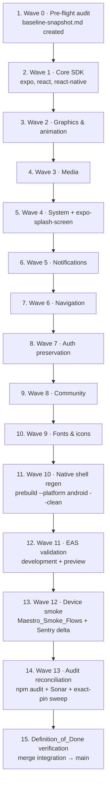

# Implementation Plan: Expo_SDK_Upgrade

## Overview

This plan executes the wave-based migration defined in `design.md` to move Trofinho from Expo SDK 55 / React Native 0.83.6 to Target_SDK Expo SDK 56 with React Native 0.85.x and `expo-splash-screen@56.x`. Each wave is a single short-lived branch named `chore/expo-sdk-upgrade-<wave-slug>` cut from the integration branch `chore/expo-sdk-upgrade`, validated against the local Validation_Gate (`npm run lint`, `npm run typecheck`, `npm test`), reviewed, and merged before the next wave starts. Waves 1–9 follow the codemod pattern in `design.md#codemod-policy`. `npx expo install --fix` is **HITL-gated** per `AGENTS.md` and must pause for explicit human approval before being run. No production EAS activity, no iOS, no Supabase migration/function/RPC edits, no coverage threshold relaxation.

The Validation_Gate (referenced as VG below) is the project's mandatory pipeline: `npm run lint && npm run typecheck && npm test`, each exiting 0, with test count `>=` Baseline_Snapshot count and unchanged `vitest.config.ts` thresholds (`lib/**` 90/90/90/84). After **any** code-touching task, VG must run green before the task is considered done.

## Tasks

- [ ] 1. Wave 0 — Pre-flight audit and Baseline_Snapshot capture
  - [x] 1.1 Cut integration and Wave 0 branches
    - From `main`, create integration branch `chore/expo-sdk-upgrade`; from it, create wave branch `chore/expo-sdk-upgrade-pre-flight-audit`.
    - Verify HEAD is clean and `npm ci` produces no lockfile churn before any audit step.
    - _Requirements: 7.1_

  - [x] 1.2 Capture current versions into Baseline_Snapshot
    - Read `expo`, `react-native`, `react`, `expo-splash-screen` versions from `package.json` and `package-lock.json`; record `git rev-parse HEAD` and the ISO 8601 timestamp.
    - Write the `## Captured at` and `## Versions` sections of `.kiro/specs/expo-sdk-upgrade/baseline-snapshot.md` per the format in `design.md#baseline_snapshot-file-format`.
    - _Requirements: 1.4, 7.1_
    - _Parallel: yes_

  - [x] 1.3 Run baseline `npm audit --json` and record HIGH/CRITICAL inventory
    - Execute `npm audit --json` at HEAD; capture full JSON output, HIGH count, CRITICAL count, and the full set of advisory ids present (must include `GHSA-w5hq-g745-h8pq`).
    - Append the `## npm audit (baseline)` section to `baseline-snapshot.md`.
    - _Requirements: 4.1, 4.2, 7.1_
    - _Parallel: yes_

  - [x] 1.4 Query SonarCloud baseline quality gate via MCP
    - Resolve project key with `mcp_sonarqube_search_my_sonarqube_projects` (must return `maxjuniorbr_trofinho`); then call `mcp_sonarqube_get_project_quality_gate_status` with that key.
    - Record status (`Passed | Failed | Warning`), HIGH count, BLOCKER count, and the set of issue ids present in `## SonarCloud quality gate (baseline)`.
    - _Requirements: 4.3, 7.1_
    - _Parallel: yes_

  - [x] 1.5 Record baseline Vitest coverage report
    - Run `npm test` with coverage at HEAD; archive lcov/html output to `.tmp/coverage-baseline/` (do not commit).
    - Append `## Vitest coverage (baseline)` with test count and the `lib/**` thresholds (statements/lines/functions/branches `90/90/90/84`).
    - _Requirements: 2.2, 2.3, 7.1_
    - _Parallel: yes_

  - [x] 1.6 Capture Sentry unresolved issue identifiers for production release
    - Use Sentry MCP (`mcp_sentry_*`) against org `maxjuniorbrs-organization`, project `react-native`; verify slug with `mcp_sentry_whoami` if uncertain.
    - Record current production release id, capture timestamp, and the full set of unresolved issue ids in `## Sentry unresolved issues (baseline)`.
    - _Requirements: 3.4, 7.1_
    - _Parallel: yes_

  - [x] 1.7 Confirm baseline Validation_Gate is green
    - Run `npm run lint`, `npm run typecheck`, `npm test` against HEAD; all three must exit 0 before Wave 0 can be merged.
    - This is the only check that gates Wave 0; no source under `app/`, `lib/`, `src/`, `supabase/`, or `android/` is modified by this wave.
    - _Requirements: 2.1_

  - [-] 1.8 Merge Wave 0 PR after review
    - Open PR `chore/expo-sdk-upgrade-pre-flight-audit` → `chore/expo-sdk-upgrade`; PR description references `baseline-snapshot.md` and asserts no source files outside `.kiro/specs/expo-sdk-upgrade/` were touched.
    - Gate on review approval before merging into the integration branch.
    - _Requirements: 6.6, 7.1_

- [ ] 2. Wave 1 — Core SDK bump (`expo`, `react`, `react-dom`, `react-native`, `@types/react`, optional `@sentry/react-native`)
  - [~] 2.1 Cut Wave 1 branch and edit core SDK pins
    - From integration HEAD, cut `chore/expo-sdk-upgrade-core-sdk`; hand-edit `package.json` dependencies for `expo`, `react`, `react-dom`, `react-native`, `@types/react` to SDK 56-recommended versions per `design.md#target-sdk-decision`.
    - Update `@sentry/react-native` only if SDK 56 release notes pin a specific minor; otherwise leave it alone (its preservation contract is the `expo.install.exclude` entry).
    - Keep `package.json#expo.install.exclude` unchanged for this wave.
    - _Requirements: 1.1, 1.4, 5.5_

  - [~] 2.2 HITL pause: request approval to run `npx expo install --fix`
    - **STOP and wait for explicit human approval** per `AGENTS.md` ("Do not auto-run risky fix commands"). Document the approval in the PR description.
    - If approved: run codemod and commit its output verbatim as `chore: apply expo install fix codemod`. If denied: hand-pin only.
    - _Requirements: 5.5_

  - [~] 2.3 Exact-pin sweep on lines touched by the codemod
    - In a separate commit `chore: pin core sdk deps to exact versions`, strip `^` and `~` operators from every dependency line modified in 2.1/2.2.
    - Confirm `grep -E '"\^|~|>=' package.json | grep -v overrides` returns no hits on dependency lines added or modified by this wave.
    - _Requirements: 4.4_

  - [~] 2.4 Validate `expo.install.exclude` policy for Wave 1
    - For each entry in `package.json#expo.install.exclude`, decide keep / prune / extend per `design.md#codemod-policy`. For Wave 1, default is **keep** (no pruning).
    - Document the decision in the wave commit message with a one-line `SDK 56 pins X@Y; current is X@Z; <keep|prune> because <reason>` justification per touched entry.
    - _Requirements: 5.5_

  - [~] 2.5 Run Validation_Gate and preservation predicates for Wave 1
    - Run VG; assert test count `>=` Baseline_Snapshot count, thresholds in `vitest.config.ts` unchanged.
    - Run preservation snippets from `design.md#preservation-strategy`: `git diff <merge-base> -- supabase/migrations supabase/functions` empty (Property 1); `app/(auth)/** lib/auth/**` content-empty (Property 8); no removal of `Sentry.setUser`-with-id-only or new PII-bearing Sentry call (Property 7).
    - _Requirements: 2.1, 2.2, 2.3, 5.2, 5.3, 5.4_

  - [~] 2.6 Snapshot `npm audit --json` and SonarCloud gate for Wave 1
    - Capture `npm audit --json`; assert HIGH `<=` baseline HIGH and CRITICAL `<=` baseline CRITICAL; if any new advisory at HIGH/CRITICAL absent from baseline appears, follow Req 4.5 escalation.
    - Query SonarCloud quality gate once for the Wave 1 branch; record status URL in PR description; do **not** re-query after edits per `sonarqube-mcp.md`.
    - _Requirements: 4.2, 4.3, 4.5_

  - [~] 2.7 Open Wave 1 PR with preservation predicate snippet and gate on review
    - PR description includes the runnable `git diff` snippets from `design.md#preservation-strategy` with their `0` outputs, the `npm audit` deltas, and the SonarCloud gate URL.
    - Merge into integration branch only after review approval.
    - _Requirements: 5.4, 7.4_

- [ ] 3. Wave 2 — Graphics & animation peer libraries
  - [~] 3.1 Cut Wave 2 branch and edit graphics/animation pins
    - From integration HEAD, cut `chore/expo-sdk-upgrade-graphics-animation`; hand-edit `package.json` dependencies for `react-native-gesture-handler`, `react-native-reanimated`, `react-native-worklets`, `react-native-screens`, `react-native-safe-area-context`, `react-native-svg`, `@shopify/flash-list` per the per-package exclude-list policy in `design.md#wave-2`.
    - For each package currently listed in `expo.install.exclude`, prune the entry only if SDK 56 pins `<=` currently-installed version, with one-line justification.
    - _Requirements: 1.1, 5.5_

  - [~] 3.2 HITL pause: request approval to run `npx expo install --fix` (if needed)
    - **STOP and wait for explicit human approval** before invoking the codemod. Commit codemod output as `chore: apply expo install fix codemod` separately from hand-edits.
    - _Requirements: 5.5_

  - [~] 3.3 Verify Reanimated/Worklets Babel/Metro plugin order
    - Cross-check `babel.config.js` plugin order against the upstream Reanimated upgrade docs for the target patch; introduce no edits unless the upgrade guide requires it. Document any required change in the commit message.
    - _Requirements: 5.5, 6.2_

  - [~] 3.4 Exact-pin sweep, Validation_Gate, and preservation predicates
    - Strip `^`/`~` on touched lines (commit `chore: pin graphics-animation deps to exact versions`); run VG; run preservation predicates with extra attention to `lib/animations/**` and `src/components/**` test surfaces.
    - Verify Tenant_Boundary intact (Property 6) on any `lib/`/`src/hooks/queries/` diff.
    - _Requirements: 2.1, 2.2, 2.3, 4.4, 5.1, 5.4_

  - [~] 3.5 Snapshot `npm audit --json`, open PR, gate on review
    - Capture audit delta; assert no new HIGH/CRITICAL absent from baseline; record SonarCloud gate URL; PR includes preservation predicate snippet outputs; merge after review.
    - _Requirements: 4.2, 4.3, 7.4_

- [ ] 4. Wave 3 — Media SDK packages (`expo-image*`, `expo-file-system`, `expo-clipboard`)
  - [~] 4.1 Cut Wave 3 branch and prepare media dep edits
    - From integration HEAD, cut `chore/expo-sdk-upgrade-media`; identify the SDK 56-pinned versions for `expo-image`, `expo-image-picker`, `expo-image-manipulator`, `expo-file-system`, `expo-clipboard`.
    - Confirm assets in `assets/` and any `react-native` `Image` import are out of scope (none should exist per `AGENTS.md`).
    - _Requirements: 1.1, 6.2_

  - [~] 4.2 HITL pause and `expo install --fix` codemod
    - **STOP and wait for explicit human approval** for `npx expo install --fix`; this wave prefers the codemod over hand-pinning because these are SDK-managed packages.
    - Commit codemod output as `chore: apply expo install fix codemod`.
    - _Requirements: 5.5_

  - [~] 4.3 Exact-pin sweep, `expo.install.exclude` validation, Validation_Gate
    - Commit `chore: pin media deps to exact versions` stripping `^`/`~` on touched lines; default is **keep** for these packages' exclude entries (none currently listed); run VG.
    - _Requirements: 2.1, 2.2, 2.3, 4.4_

  - [~] 4.4 Snapshot `npm audit --json`, open PR with preservation snippet, gate on review
    - Capture audit delta; record SonarCloud gate URL; PR includes preservation predicate snippet outputs (Property 1, Property 8 must hold); merge after review.
    - _Requirements: 4.2, 4.3, 5.3, 5.4, 7.4_

- [ ] 5. Wave 4 — System SDK packages (incl. `expo-splash-screen`)
  - [~] 5.1 Cut Wave 4 branch and prepare system dep edits
    - From integration HEAD, cut `chore/expo-sdk-upgrade-system`; identify SDK 56 pins for `expo-secure-store`, `expo-application`, `expo-constants`, `expo-crypto`, `expo-device`, `expo-font`, `expo-haptics`, `expo-linear-gradient`, `expo-linking`, `expo-status-bar`, `expo-system-ui`, `expo-updates`, `expo-vector-icons`, `expo-dev-client`, `expo-splash-screen`.
    - Read-only confirm `app.json` `runtimeVersion.policy: appVersion`, `updates.url`, `updates.checkAutomatically` are unchanged.
    - _Requirements: 1.1, 5.5_

  - [~] 5.2 HITL pause and `expo install --fix` codemod
    - **STOP and wait for explicit human approval** before running `npx expo install --fix`. Commit codemod output verbatim.
    - _Requirements: 5.5_

  - [~] 5.3 Exact-pin sweep and `expo.install.exclude` policy
    - Commit `chore: pin system deps to exact versions` stripping `^`/`~`. Validate exclude policy: keep entries by default; document any prune/extend with one-line justification.
    - _Requirements: 4.4_

  - [~] 5.4 Run Validation_Gate, preservation predicates, audit, open PR
    - VG green; preservation predicates hold (no `app.json` `runtimeVersion`/`updates` changes; `expo-updates` config block unchanged); `npm audit --json` snapshot; SonarCloud gate URL; merge after review.
    - _Requirements: 2.1, 2.2, 2.3, 4.2, 4.3, 4.4, 6.5, 7.4_

- [ ] 6. Wave 5 — Notifications (`expo-notifications`)
  - [~] 6.1 Cut Wave 5 branch and edit `expo-notifications` pin
    - From integration HEAD, cut `chore/expo-sdk-upgrade-notifications`; hand-edit `expo-notifications` to SDK 56 pin.
    - Preserve the plugin entry `["expo-notifications", { "icon": "./assets/notification-icon.png", "color": "#C8860A" }]` in `app.json` verbatim; re-emit only if codemod rewrites the array.
    - _Requirements: 1.1, 5.5_

  - [~] 6.2 HITL pause and codemod
    - **STOP and wait for explicit human approval** for `npx expo install --fix`. Commit codemod output verbatim.
    - _Requirements: 5.5_

  - [~] 6.3 Verify Sentry PII rules and 12-char push-token masking remain intact
    - Run preservation predicate for Property 7 across `lib/observability/**` and `src/**` diff; confirm push-token logging continues to use the existing 12-char mask per `security.md`.
    - Confirm `supabase/functions/send-push-notification/**` is diff-empty (Req 6.3).
    - _Requirements: 5.2, 6.3_

  - [~] 6.4 Exact-pin sweep, Validation_Gate, audit, open PR
    - Commit `chore: pin notifications deps to exact versions`; run VG; capture `npm audit --json` snapshot; record SonarCloud gate URL; merge after review.
    - _Requirements: 2.1, 2.2, 2.3, 4.2, 4.3, 4.4, 7.4_

- [ ] 7. Wave 6 — Navigation (`expo-router`)
  - [~] 7.1 Cut Wave 6 branch and edit `expo-router` pin
    - From integration HEAD, cut `chore/expo-sdk-upgrade-navigation`; hand-edit `expo-router` to SDK 56 pin; preserve `"main": "expo-router/entry"` in `package.json`.
    - _Requirements: 1.1, 5.5_

  - [~] 7.2 HITL pause and `expo install --fix` codemod
    - **STOP and wait for explicit human approval** before running the codemod. If a router codemod regenerates typed routes, place that change in a separate commit `chore: regenerate expo-router typed routes` so the diff is reviewable.
    - _Requirements: 5.5_

  - [~] 7.3 Run Validation_Gate with focus on route tests
    - VG green; `app/**/*.test.tsx` route tests are the primary signal; assert no new route added, no route renamed, no auth-flow rerouting introduced.
    - _Requirements: 2.1, 2.2, 5.3, 5.5_

  - [~] 7.4 Exact-pin sweep, audit, open PR with preservation snippet, gate on review
    - Commit `chore: pin navigation deps to exact versions`; capture `npm audit --json` delta; record SonarCloud gate URL; PR includes preservation predicate output for `app/(auth)/**` and `lib/auth/**` content-empty; merge after review.
    - _Requirements: 4.2, 4.3, 4.4, 5.3, 7.4_

- [ ] 8. Wave 7 — Auth preservation (`@react-native-google-signin/google-signin`)
  - [~] 8.1 Cut Wave 7 branch as preservation-only
    - From integration HEAD, cut `chore/expo-sdk-upgrade-auth-preserve`; this wave is preservation-only per Req 5.3 and `design.md#wave-7`.
    - Read-check `app.json` plugin entry and import sites in `lib/auth/**`; do not modify.
    - _Requirements: 5.3_

  - [~] 8.2 Hand-edit version pin only if SDK 56 mandates it
    - If the SDK 56 compatibility matrix names a specific minor for `@react-native-google-signin/google-signin`, hand-edit the pin (no `expo install --fix` for this wave). Otherwise leave the pin unchanged.
    - If a type-only signature update is required, apply the smallest possible change consistent with Req 5.5; document inline.
    - _Requirements: 1.1, 5.3, 5.5_

  - [~] 8.3 Verify Frozen_Auth_Surface preservation predicate
    - Run `git diff <merge-base> -- 'app/(auth)/**' 'lib/auth/**'`; output must be content-empty (only formatting whitespace permitted).
    - If any non-import-path-rewrite line appears, **revert the wave and re-plan** per `design.md#validation-gates-and-rollback`.
    - _Requirements: 5.3_

  - [~] 8.4 Run Validation_Gate, audit, open PR, gate on review
    - VG green; capture `npm audit --json` snapshot; record SonarCloud gate URL; PR description includes the empty-diff predicate output for the auth paths; merge after review.
    - _Requirements: 2.1, 2.2, 4.2, 4.3, 5.3, 5.4, 7.4_

- [ ] 9. Wave 8 — Community packages (`datetimepicker`, `netinfo`, `slider`)
  - [~] 9.1 Cut Wave 8 branch and edit community pins
    - From integration HEAD, cut `chore/expo-sdk-upgrade-community`; hand-edit `@react-native-community/datetimepicker`, `@react-native-community/netinfo`, `@react-native-community/slider` per `design.md#wave-8`.
    - For `slider` (currently in `expo.install.exclude`), prune the exclude entry only if the SDK 56 pin is intended to move forward, justified inline.
    - _Requirements: 1.1, 5.5_

  - [~] 9.2 HITL pause and `expo install --fix` codemod
    - **STOP and wait for explicit human approval** before running `npx expo install --fix`. Commit codemod output verbatim; preserve the `datetimepicker` plugin entry in `app.json`.
    - _Requirements: 5.5_

  - [~] 9.3 Exact-pin sweep, Validation_Gate, preservation predicates
    - Commit `chore: pin community deps to exact versions`; run VG; verify Tenant_Boundary unchanged on any `lib/`/`src/hooks/queries/` diff (Property 6); confirm no UI re-styling on date/time pickers (Req 6.2).
    - _Requirements: 2.1, 2.2, 4.4, 5.1, 6.2_

  - [~] 9.4 Snapshot audit, open PR, gate on review
    - Capture `npm audit --json`; record SonarCloud gate URL; PR includes preservation predicate outputs; merge after review.
    - _Requirements: 4.2, 4.3, 7.4_

- [ ] 10. Wave 9 — Fonts and icons (`@expo-google-fonts/nunito`, `@expo/vector-icons`)
  - [~] 10.1 Cut Wave 9 branch and hand-edit pins
    - From integration HEAD, cut `chore/expo-sdk-upgrade-fonts-icons`; hand-edit `@expo-google-fonts/nunito` and `@expo/vector-icons` pins to exact SDK 56-aligned versions.
    - This wave does **not** run `expo install --fix` (these packages are not strictly SDK-pinned). No HITL approval needed for codemod absence.
    - _Requirements: 1.1, 5.5_

  - [~] 10.2 Validate `expo.install.exclude` policy and exact pins
    - Default to **keep** exclude entries; document any change with one-line justification.
    - Confirm `grep -E '"\^|~|>=' package.json | grep -v overrides` returns no hits on dependency lines added or modified by this wave.
    - _Requirements: 4.4_

  - [~] 10.3 Run Validation_Gate with focus on icon-bearing component tests
    - VG green; snapshot/render tests for icon-bearing components are the primary signal; confirm no Lucide icon replacements introduced (`AGENTS.md` non-negotiable).
    - _Requirements: 2.1, 2.2, 6.2_

  - [~] 10.4 Snapshot audit, open PR with preservation snippet, gate on review
    - Capture `npm audit --json` delta; record SonarCloud gate URL; PR includes preservation predicate outputs; merge after review.
    - _Requirements: 4.2, 4.3, 7.4_

- [ ] 11. Wave 10 — Native shell regeneration via `expo prebuild --platform android --clean`
  - [~] 11.1 Cut Wave 10 branch only after every JS-side wave is merged
    - From integration HEAD (must contain Waves 0–9 merged), cut `chore/expo-sdk-upgrade-native-shell-regen`. Confirm VG is green at integration HEAD before cutting.
    - _Requirements: 5.5, 7.4_

  - [~] 11.2 Run `npx expo prebuild --platform android --clean`
    - Run the command; commit the regenerated `android/` tree as a single commit `chore: regenerate android shell for sdk 56`.
    - Out-of-scope artefacts (`android/app/google-services.json`, `android/app/debug.keystore`, `android/sentry.properties`, `android/local.properties`, hand-customized files in `android/app/src/main/java/com/maxjuniorbr/trofinho/`) may be deleted or rewritten by `prebuild --clean`; do not stop the wave at this point.
    - _Requirements: 1.5, 5.5_

  - [~] 11.3 Restore preserved Android artefacts from merge base
    - In a separate commit `chore: restore preserved android artefacts`, restore from the merge base: `android/app/google-services.json`, `android/app/debug.keystore`, `android/sentry.properties`, `android/local.properties`, plus any hand-customized files in `android/app/src/main/java/com/maxjuniorbr/trofinho/` (verify there are none currently before reverting).
    - _Requirements: 5.5_

  - [~] 11.4 Verify all preservation invariants from `design.md#native-shell-regeneration`
    - Walk every row of the preservation invariants table: `applicationId` `com.maxjuniorbr.trofinho`, `googleServicesFile` reference and presence of `android/app/google-services.json`, adaptive icon mipmap references, `predictiveBackGestureEnabled: false` in `AndroidManifest.xml`, `runtimeVersion.policy: appVersion`, plugin list (`expo-router`, `expo-notifications`, `expo-secure-store`, `expo-font`, `expo-image`, `@react-native-community/datetimepicker`, `@react-native-google-signin/google-signin`, `@sentry/react-native/expo`) appearing in `android/settings.gradle`, JVM args from `withGradleProperties` in `android/gradle.properties`, React Compiler enabled, `metro.config.js` unchanged.
    - Any failed invariant → revert wave and re-plan per `design.md#validation-gates-and-rollback`.
    - _Requirements: 5.5, 6.1, 6.5_

  - [~] 11.5 Run `npm run android` compile-only smoke and full Validation_Gate
    - Run `npm run android` as a compile-only check (this wave is not the real-device run; that is Wave 12). VG must also be green.
    - _Requirements: 2.1, 2.2_

  - [~] 11.6 Open Wave 10 PR with preservation invariants table, gate on review
    - PR description includes the filled-in preservation invariants table (each row marked verified) and the compile smoke output. Merge after review.
    - _Requirements: 7.4_

- [ ] 12. Wave 11 — EAS validation (development + preview profiles)
  - [~] 12.1 Cut Wave 11 branch and trigger development EAS build
    - From integration HEAD, cut `chore/expo-sdk-upgrade-eas-validation`; run `eas build --profile development --platform android` with no edits to `eas.json`.
    - Capture build URL and final status; assert status is `finished` and the artefact is downloadable.
    - _Requirements: 3.1, 6.5_

  - [~] 12.2 Trigger preview EAS build
    - Run `eas build --profile preview --platform android`; capture build URL and final status; assert status is `finished` and the artefact is downloadable.
    - _Requirements: 3.2, 6.5_

  - [~] 12.3 Append EAS evidence to Baseline_Snapshot
    - Append the development build URL and status, and the preview build URL and status, to `.kiro/specs/expo-sdk-upgrade/baseline-snapshot.md` under `## EAS evidence`.
    - _Requirements: 3.1, 3.2, 7.4_

  - [~] 12.4 Open Wave 11 PR and gate on review
    - PR description references both build URLs and asserts no `eas submit`, no `eas update --branch production`, no `production` profile activity occurred. Merge after review.
    - _Requirements: 3.5, 6.5, 7.4_

- [ ] 13. Wave 12 — Device smoke (Maestro flows + Sentry delta on Smoke_Device)
  - [~] 13.1 Cut Wave 12 branch and install preview artefact on Smoke_Device
    - From integration HEAD, cut `chore/expo-sdk-upgrade-device-smoke`; install the Wave 11 preview artefact on a real Smoke_Device (Pixel 7 emulator at `~/Android/Sdk/emulator/emulator -avd Pixel_7` or a physical device).
    - _Requirements: 3.3_

  - [~] 13.2 Perform Google OAuth sign-in via Frozen_Auth_Surface
    - Sign in on the Smoke_Device using Google OAuth via `@react-native-google-signin/google-signin` + `signInWithIdToken()` only — no email/password path; confirm role-appropriate home (`app/(admin)/index.tsx` or `app/(child)/index.tsx`) renders without process termination or fatal error overlay.
    - Capture screenshot via `npm run android:screenshot` and UI dump via `npm run android:ui` (outputs at `.tmp/screen.png`, `.tmp/window.xml`).
    - _Requirements: 3.3, 5.3_

  - [~] 13.3 Run `.maestro/create-task.yaml`
    - Run the create-task Maestro flow against the Smoke_Device; assert exit code 0 and every assertion passes within configured timeout. Capture report log.
    - _Requirements: 2.4_

  - [~] 13.4 Run `.maestro/logout.yaml`
    - Run the logout Maestro flow against the Smoke_Device; assert exit code 0. Capture report log.
    - _Requirements: 2.4_

  - [~] 13.5 Capture Sentry issue id delta vs Baseline_Snapshot
    - Use Sentry MCP to enumerate unresolved issue ids surfaced during the smoke session; compare against the baseline set captured in 1.6.
    - Any new issue id absent from the baseline fails the gate per Req 3.4 — revert via `git bisect` against the integration branch to attribute the regression to its source wave, then re-plan.
    - _Requirements: 3.4_

  - [~] 13.6 Append smoke evidence to Baseline_Snapshot
    - Append Maestro report log snippets, screenshot/UI dump references, and Sentry id delta to `baseline-snapshot.md` under `## Smoke evidence` and `## Sentry evidence`.
    - Confirm orphan `test:e2e:*` scripts in `package.json` (`test:e2e:login`, `test:e2e:create-account`, `test:e2e:login-wrong-password`, `test:e2e:login-empty-fields`) remain unmodified per Req 6.4.
    - _Requirements: 2.4, 3.3, 3.4, 6.4, 7.4_

  - [~] 13.7 Open Wave 12 PR and gate on review
    - PR description references Maestro logs, screenshot/UI dump artefacts, and Sentry id delta (must be empty). Merge after review.
    - _Requirements: 7.4_

- [ ] 14. Wave 13 — Audit reconciliation
  - [~] 14.1 Cut Wave 13 branch and run post-upgrade `npm audit --json`
    - From integration HEAD, cut `chore/expo-sdk-upgrade-audit-reconcile`; run `npm audit --json` against the post-upgrade lockfile; capture full JSON output.
    - _Requirements: 4.1, 4.2_

  - [~] 14.2 Verify advisory `GHSA-w5hq-g745-h8pq` is resolved
    - Assert `GHSA-w5hq-g745-h8pq` does not appear in the post-upgrade `npm audit` output. If it appears, halt the wave and request HITL per Req 4.5 / Req 7.3.
    - _Requirements: 4.1_

  - [~] 14.3 Verify HIGH/CRITICAL counts non-worsening
    - Assert post-upgrade HIGH count `<=` baseline HIGH count and post-upgrade CRITICAL count `<=` baseline CRITICAL count; assert no new advisory id at HIGH/CRITICAL severity absent from baseline.
    - On any regression, follow Req 4.5 escalation: record advisory id, severity, package on the upgrade branch; resolve before merge or halt for HITL.
    - _Requirements: 4.2, 4.5_

  - [~] 14.4 Verify SonarCloud quality gate `Passed` with no new HIGH/BLOCKER
    - Resolve project key with `mcp_sonarqube_search_my_sonarqube_projects` (`maxjuniorbr_trofinho`); call `mcp_sonarqube_get_project_quality_gate_status` against the integration branch; assert status `Passed` and no HIGH/BLOCKER absent from baseline.
    - Per `sonarqube-mcp.md`, do not re-query after fixes within this wave; trust local validation and next CI cycle.
    - _Requirements: 4.3_

  - [~] 14.5 Final exact-pin sweep on `package.json`
    - Run `grep -E '"\^|~|>=' package.json | grep -v overrides`; output must be empty for any dependency line modified by Waves 1–9.
    - Confirm `package.json` `overrides` block (`@xmldom/xmldom`, `postcss`) is preserved at versions `>=` baseline.
    - _Requirements: 4.4_

  - [~] 14.6 Append all Wave 13 evidence to Baseline_Snapshot
    - Append `## Post-upgrade audit` (full `npm audit --json`, HIGH/CRITICAL delta, advisory id delta), `## Sonar evidence` (quality gate status URL), and any Wave 13 retry record under `## Wave 13 retry` if applicable.
    - _Requirements: 4.1, 4.2, 4.3, 7.1, 7.4_

  - [~] 14.7 Run Validation_Gate one last time and open Wave 13 PR
    - VG green on the Wave 13 branch; PR description references the appended `baseline-snapshot.md` sections; merge after review.
    - _Requirements: 2.1, 2.2, 7.4_

- [ ] 15. Definition_of_Done verification and merge integration branch to main
  - [~] 15.1 Verify Validation_Gate green on integration HEAD
    - Run `npm run lint`, `npm run typecheck`, `npm test` on integration branch HEAD; all three exit 0; test count `>=` baseline; coverage thresholds unchanged.
    - _Requirements: 2.1, 2.2, 2.3, 7.2_

  - [~] 15.2 Verify Maestro_Smoke_Flows pass on Smoke_Device
    - Confirm Wave 12's `## Smoke evidence` section in `baseline-snapshot.md` records exit code 0 for both `.maestro/create-task.yaml` and `.maestro/logout.yaml`.
    - _Requirements: 2.4, 7.2_

  - [~] 15.3 Verify EAS development and preview builds finished
    - Confirm Wave 11's `## EAS evidence` section in `baseline-snapshot.md` lists both build URLs with status `finished` and downloadable artefacts.
    - Confirm no production EAS activity occurred (no `eas submit`, no `eas update --branch production`, no `production` profile run).
    - _Requirements: 3.1, 3.2, 3.5, 6.5, 7.2_

  - [~] 15.4 Verify post-login smoke on Smoke_Device passed without new Sentry issues
    - Confirm Wave 12's `## Sentry evidence` section records an empty delta of unresolved issue ids vs baseline (no new id absent from baseline).
    - _Requirements: 3.3, 3.4, 7.2_

  - [~] 15.5 Verify advisory `GHSA-w5hq-g745-h8pq` resolved and audit posture non-worsening
    - Confirm Wave 13's `## Post-upgrade audit` section records `GHSA-w5hq-g745-h8pq` absent from `npm audit` output and HIGH/CRITICAL counts/ids non-worsening vs baseline.
    - _Requirements: 4.1, 4.2, 7.2_

  - [~] 15.6 Verify SonarCloud quality gate `Passed` with no new HIGH/BLOCKER
    - Confirm Wave 13's `## Sonar evidence` section records status `Passed` and no HIGH/BLOCKER issue absent from baseline on the integration branch's latest analysis (project key `maxjuniorbr_trofinho`).
    - _Requirements: 4.3, 7.2_

  - [~] 15.7 Confirm every Definition_of_Done condition is verifiable from integration branch alone
    - Walk the Definition_of_Done evidence map in `design.md#definition_of_done-evidence-map`; every row must reference an artefact reachable from integration HEAD via `baseline-snapshot.md` URL or relative path.
    - No condition deferred to post-merge cleanup.
    - _Requirements: 7.4_

  - [~] 15.8 HITL pause: open final integration → main PR and gate on review
    - **STOP and wait for explicit human approval** before merging `chore/expo-sdk-upgrade` into `main`. PR description summarizes every Wave PR and links the filled `baseline-snapshot.md` sections.
    - On any failed condition, do not merge; record the failed condition and reason on the upgrade branch per Req 7.3 before any subsequent verification attempt.
    - _Requirements: 7.2, 7.3, 7.4_

## Notes

- This plan executes only what is documented in `requirements.md` and `design.md`. No new requirements, no new design decisions.
- Every `npx expo install --fix` invocation requires explicit HITL approval per `AGENTS.md` and is called out as a HITL pause sub-task.
- The `Validation_Gate` (`npm run lint`, `npm run typecheck`, `npm test`) is mandatory after **any** code-touching task; it is not enumerated as a separate top-level task because it is implicit in every wave's "ready to merge" criteria per `design.md#validation-gates-and-rollback`.
- `vitest.config.ts` `lib/**` thresholds (`90/90/90/84` statements/lines/functions/branches) are not lowered in any wave (Req 2.3).
- `supabase/migrations/`, `supabase/functions/`, RPC contracts, `src/types/database.types.ts`, `ios/`, `Podfile`, and EAS `production` profile are out of scope and diff-empty against merge base on every wave (Req 5.4, 6.1, 6.3, 6.5).
- `.kiro/specs/expo-sdk-upgrade/baseline-snapshot.md` is created in Wave 0 and append-only thereafter — original baseline numbers are never edited; only new sections (`## Wave N retry`, `## EAS evidence`, `## Smoke evidence`, `## Sonar evidence`, `## Sentry evidence`, `## Post-upgrade audit`, `## Deferred items`) are added.
- Two consecutive failed `Validation_Gate` runs on the same change set within a wave triggers revert-and-replan per `design.md#validation-gates-and-rollback`; the retry is recorded under `## Wave N retry` in `baseline-snapshot.md`.
- Property-based testing does not apply to this upgrade (see `design.md#testing-strategy`); the existing Vitest suite is the regression net.
- Tasks marked `_Parallel: yes_` are within Wave 0 only and may run in parallel because they read independent baseline data sources, although they all converge into a single append on `baseline-snapshot.md`.

## Task Dependency Graph

The waves form a strict linear DAG. Each wave PR must merge into the integration branch `chore/expo-sdk-upgrade` before the next wave's branch can be cut. Within a wave, sub-tasks run sequentially except where `_Parallel: yes_` is annotated. The JSON below encodes parallel-execution waves for tooling; the Mermaid diagram visualizes the wave-level sequencing for humans.

```json
{
  "waves": [
    { "id": 0, "tasks": ["1.1"] },
    { "id": 1, "tasks": ["1.2", "1.3", "1.4", "1.5", "1.6"] },
    { "id": 2, "tasks": ["1.7"] },
    { "id": 3, "tasks": ["1.8"] },
    { "id": 4, "tasks": ["2.1"] },
    { "id": 5, "tasks": ["2.2"] },
    { "id": 6, "tasks": ["2.3"] },
    { "id": 7, "tasks": ["2.4"] },
    { "id": 8, "tasks": ["2.5"] },
    { "id": 9, "tasks": ["2.6"] },
    { "id": 10, "tasks": ["2.7"] },
    { "id": 11, "tasks": ["3.1"] },
    { "id": 12, "tasks": ["3.2"] },
    { "id": 13, "tasks": ["3.3"] },
    { "id": 14, "tasks": ["3.4"] },
    { "id": 15, "tasks": ["3.5"] },
    { "id": 16, "tasks": ["4.1"] },
    { "id": 17, "tasks": ["4.2"] },
    { "id": 18, "tasks": ["4.3"] },
    { "id": 19, "tasks": ["4.4"] },
    { "id": 20, "tasks": ["5.1"] },
    { "id": 21, "tasks": ["5.2"] },
    { "id": 22, "tasks": ["5.3"] },
    { "id": 23, "tasks": ["5.4"] },
    { "id": 24, "tasks": ["6.1"] },
    { "id": 25, "tasks": ["6.2"] },
    { "id": 26, "tasks": ["6.3"] },
    { "id": 27, "tasks": ["6.4"] },
    { "id": 28, "tasks": ["7.1"] },
    { "id": 29, "tasks": ["7.2"] },
    { "id": 30, "tasks": ["7.3"] },
    { "id": 31, "tasks": ["7.4"] },
    { "id": 32, "tasks": ["8.1"] },
    { "id": 33, "tasks": ["8.2"] },
    { "id": 34, "tasks": ["8.3"] },
    { "id": 35, "tasks": ["8.4"] },
    { "id": 36, "tasks": ["9.1"] },
    { "id": 37, "tasks": ["9.2"] },
    { "id": 38, "tasks": ["9.3"] },
    { "id": 39, "tasks": ["9.4"] },
    { "id": 40, "tasks": ["10.1"] },
    { "id": 41, "tasks": ["10.2"] },
    { "id": 42, "tasks": ["10.3"] },
    { "id": 43, "tasks": ["10.4"] },
    { "id": 44, "tasks": ["11.1"] },
    { "id": 45, "tasks": ["11.2"] },
    { "id": 46, "tasks": ["11.3"] },
    { "id": 47, "tasks": ["11.4"] },
    { "id": 48, "tasks": ["11.5"] },
    { "id": 49, "tasks": ["11.6"] },
    { "id": 50, "tasks": ["12.1"] },
    { "id": 51, "tasks": ["12.2"] },
    { "id": 52, "tasks": ["12.3"] },
    { "id": 53, "tasks": ["12.4"] },
    { "id": 54, "tasks": ["13.1"] },
    { "id": 55, "tasks": ["13.2"] },
    { "id": 56, "tasks": ["13.3"] },
    { "id": 57, "tasks": ["13.4"] },
    { "id": 58, "tasks": ["13.5"] },
    { "id": 59, "tasks": ["13.6"] },
    { "id": 60, "tasks": ["13.7"] },
    { "id": 61, "tasks": ["14.1"] },
    { "id": 62, "tasks": ["14.2"] },
    { "id": 63, "tasks": ["14.3"] },
    { "id": 64, "tasks": ["14.4"] },
    { "id": 65, "tasks": ["14.5"] },
    { "id": 66, "tasks": ["14.6"] },
    { "id": 67, "tasks": ["14.7"] },
    { "id": 68, "tasks": ["15.1"] },
    { "id": 69, "tasks": ["15.2"] },
    { "id": 70, "tasks": ["15.3"] },
    { "id": 71, "tasks": ["15.4"] },
    { "id": 72, "tasks": ["15.5"] },
    { "id": 73, "tasks": ["15.6"] },
    { "id": 74, "tasks": ["15.7"] },
    { "id": 75, "tasks": ["15.8"] }
  ]
}
```



Within Wave 0, sub-tasks 1.2–1.6 are independent reads and may run in parallel; 1.7 (Validation_Gate) and 1.8 (PR + merge) are sequential gates after the parallel block. All other waves are strictly sequential at the sub-task level: cut branch → edit pins → HITL pause for codemod → exact-pin sweep → Validation_Gate + preservation predicates → audit/SonarCloud snapshot → PR → review → merge.
